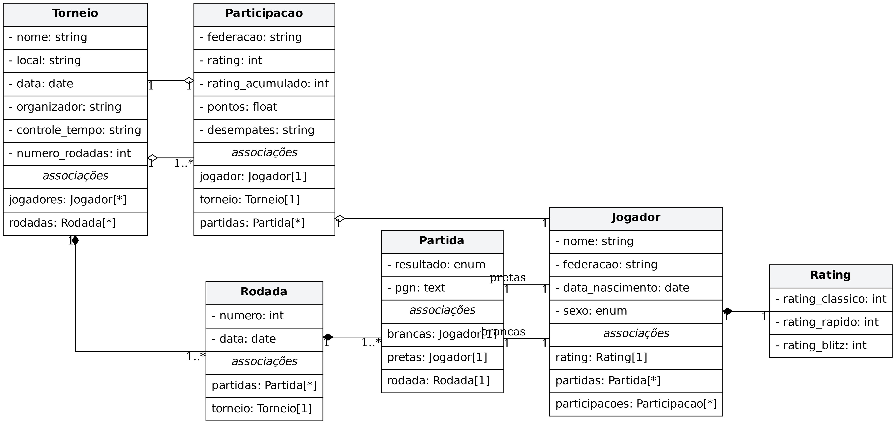

# ♟️ Swiss Chess System

Um sistema de gerenciamento de torneios de xadrez baseado no **Sistema
Suíço**, com suporte a cadastro de jogadores, controle de rodadas,
partidas, ratings e pontuação.

## 📌 Funcionalidades

-   Gerenciamento de **torneios** (nome, local, data, número de rodadas,
    organizador, controle de tempo).
-   Cadastro de **jogadores** com informações pessoais e **rating**
    (clássico, rápido, blitz).
-   Registro de **participações** em torneios (federacão, rating
    inicial, pontos, desempates).
-   Organização de **rodadas** de acordo com o **Sistema Suíço**.
-   Controle de **partidas** (brancas, pretas, resultado, PGN, rodada).
-   Armazenamento e acompanhamento de **estatísticas** de jogadores.

## 🏗️ Estrutura do Sistema

O sistema é modelado com base nas seguintes entidades principais:

-   **Torneio**: contém informações gerais e organiza rodadas e
    participações.
-   **Jogador**: representa um participante com dados pessoais e
    rating.
-   **Participação**: vincula um jogador a um torneio específico.
-   **Rodada**: conjunto de partidas de uma fase do torneio.
-   **Partida**: jogo entre dois jogadores, armazenando resultado e
    PGN.
-   **Rating**: guarda os diferentes ratings de um jogador.

### 📊 Diagrama UML

O modelo do sistema foi estruturado conforme o diagrama abaixo:

## ⚙️ Tecnologias Utilizadas

-   **Python** (para modelagem e lógica principal)

## 🤝 Contribuição

Sinta-se à vontade para contribuir!
- Faça um fork do repositório
- Crie uma branch com sua feature/fix
- Envie um pull request
